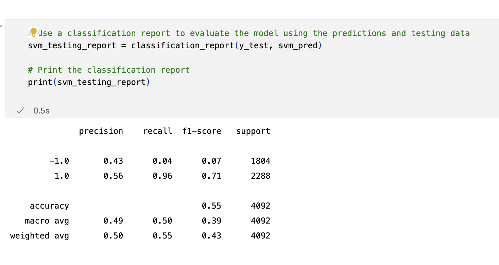
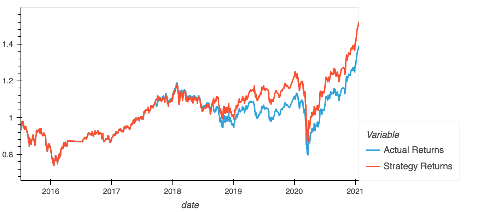
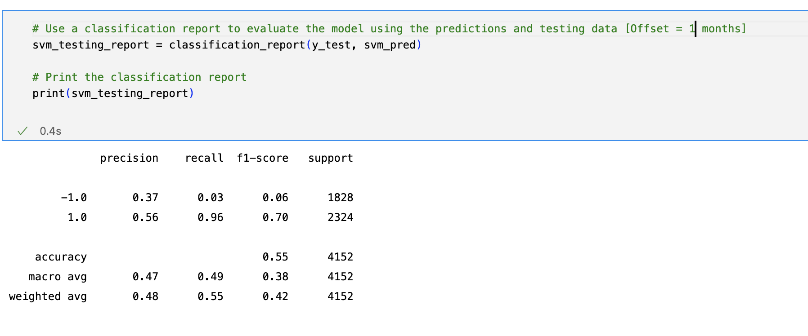
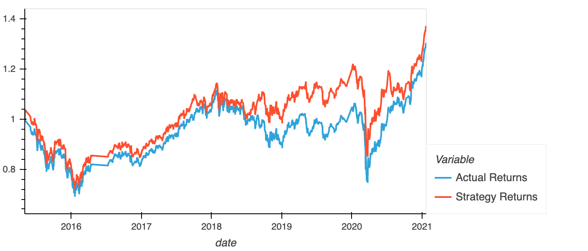
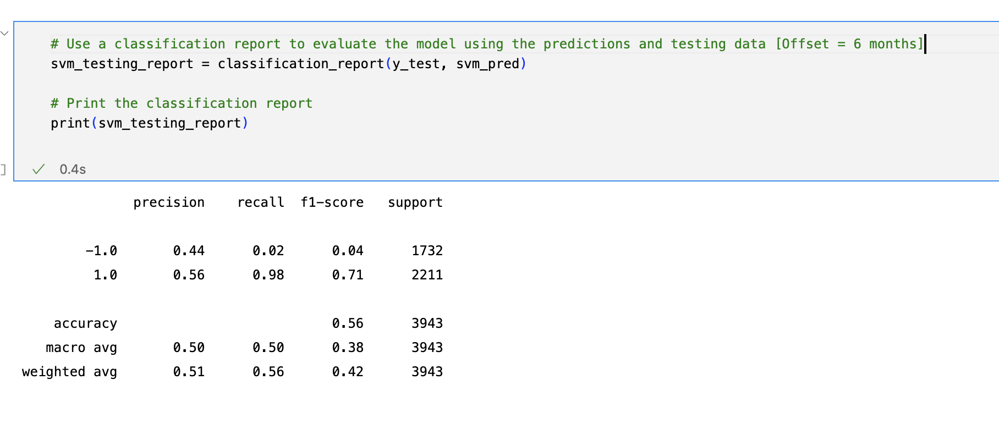
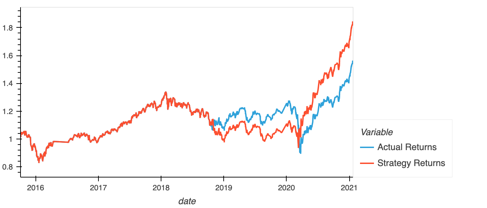
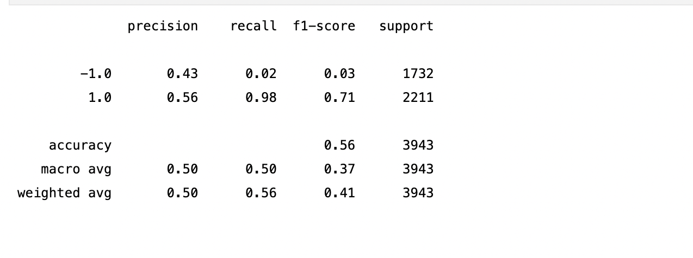
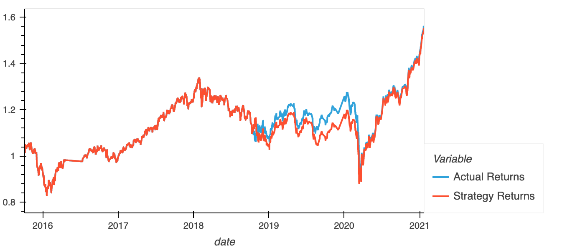
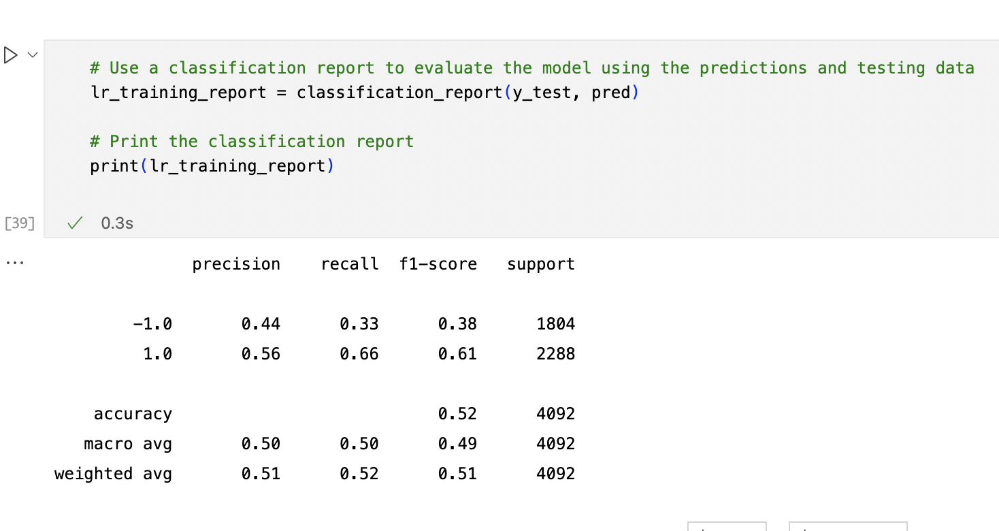
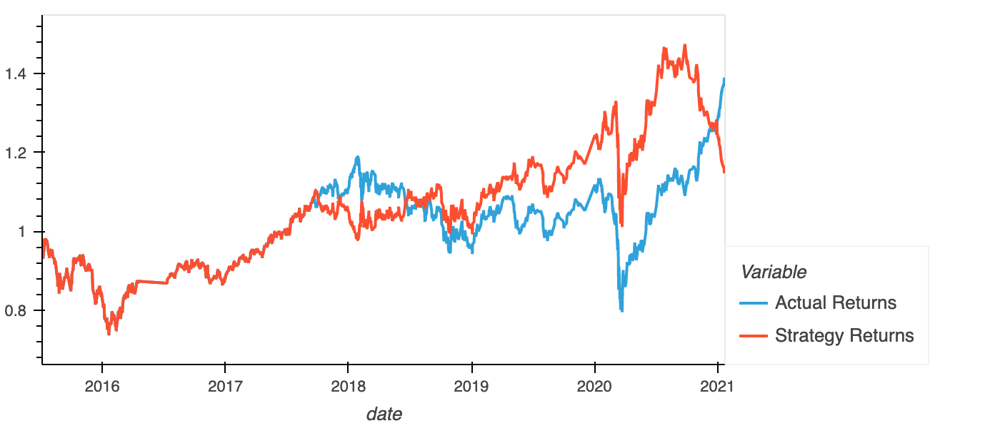

**SVM Original**

**SVM With 1 month Offset**

**SVM With 6 months Offset**

**SVM With 20 Days Slow SMA**

**LRM**

**Conclusion**
*   Increasing the offset from 3 months to 6 months did slightly improved the accuracy of the model.
*   Decreasing the offset from 3 months to 1 month, no difference was observed.
*   Increasing the Slow SMA to 20 days slightly improved the accuracy of the model.
*   With the original parameters, LVM performed worse that the SVM.
